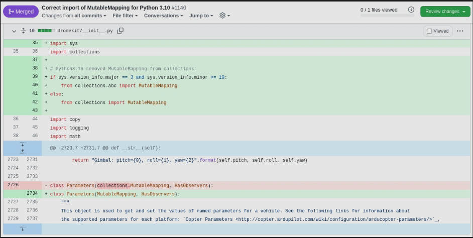

# ground-control-station-backend

## Requirement
Versi Python dibawah 3.10, kalo 3.10 keatas harus modif ```__init__.py```


## How To Run Flask in Windows
1. Install Virtualenv with pip
    ```
    pip install virtualenv
    ```

2. Build virtual environment
    ```
    py -3 -m venv venv
    ```

3. Activate virtual environment
    ```
    .\venv\Scripts\activate
    ```

4. Install Flask with pip
    ```bash
    pip install Flask
    ```

5. Install Dronekit and Dronekit-sitl with pip
    ```
    pip install dronekit
    pip install dronekit-sitl
    ```

6. Change ```__init__.py``` in package dronekit
    - add in line 38-41:
        ```
        import sys
        if sys.version_info.major == 3 and sys.version_info.minor >=  10:
            from collections.abc import MutableMapping
        else:
            from collections import MutableMapping
        ```
    - change in line 2696:
        ```
        class Parameters(collections.MutableMapping, HasObservers) 
        become 
        class Parameters(MutableMapping, HasObservers)
        ```
  
7. Install mpu with pip
    ```
    pip install mpu
    ```

8. Run
    ```
    python engine.py
    ```


    
2. 

Run
    ```bash
    python <filename>
    ```cd Project
